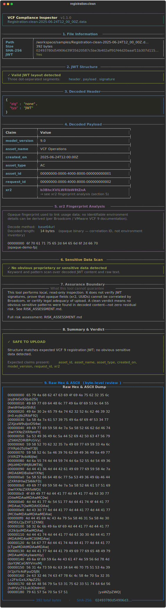
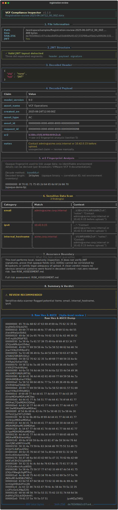
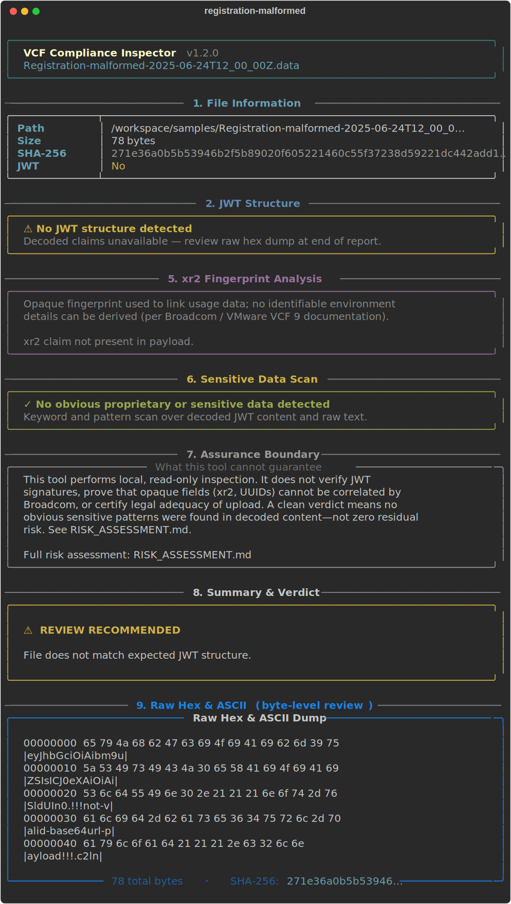
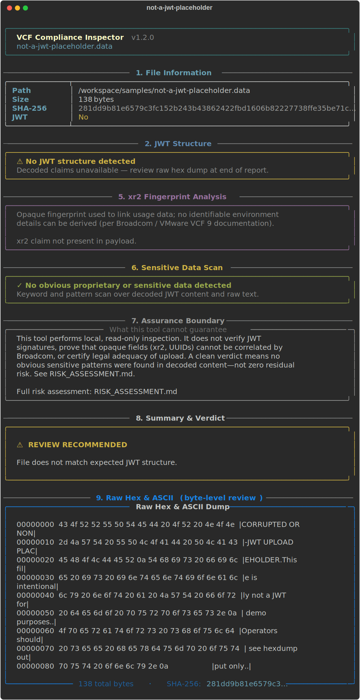

# VCF9 Disconnected Data File Viewer

Forensic CLI for safely reviewing VMware Cloud Foundation (VCF) 9+ **Registration `*.data`** files before upload in disconnected / air-gapped environments.

The `.data` artifact is a JWT containing registration metadata (including the opaque `xr2` fingerprint). This tool decodes and inspects those files locally — **no network access, no file modification** — so operators can trust-but-verify that nothing sensitive is present before sending artifacts to Broadcom.

For residual risks, assurance boundaries, and what a “clean” verdict does **not** guarantee, see **[RISK_ASSESSMENT.md](RISK_ASSESSMENT.md)**.

## Quick start

```bash
pip install -r requirements.txt

# Try the included sample files
python vcf_compliance_inspector.py samples/ --dir

# Inspect your own registration file
python vcf_compliance_inspector.py Registration-*.data
```

## What it does

| Capability | Description |
|------------|-------------|
| **SHA-256 audit hash** | Per-file digest for change tracking and SIEM logs |
| **JWT decode** | Manual base64url + JSON decode of header and payload (no signature verification) |
| **`xr2` analysis** | Decodes the opaque fingerprint; explains Broadcom’s non-identifying design |
| **Sensitive-data scan** | Keywords + regex (email, IP, internal hostnames, PEM headers, etc.) |
| **Assurance boundary** | Explicit panel on what the tool cannot guarantee (links to risk assessment) |
| **Raw hex & ASCII** | **Always shown last** — full byte-level review with colorized offset / hex / ASCII |
| **Verdict** | `SAFE TO UPLOAD` (green) or `REVIEW RECOMMENDED` (yellow) |

## Report layout (terminal)

Each file is analyzed in **nine numbered sections**. High-level decode and scans come first; the **raw hex/ASCII dump is always section 9** so reviewers finish with byte-level visibility.

| # | Section | Description |
|---|---------|-------------|
| 1 | File Information | Path, size, SHA-256, JWT yes/no |
| 2 | JWT Structure | Valid three-segment layout or warning |
| 3 | Decoded Header | Syntax-highlighted JSON (when decodable) |
| 4 | Decoded Payload | Claims table; `xr2` highlighted in magenta |
| 5 | xr2 Fingerprint Analysis | Opaque fingerprint decode + vendor context |
| 6 | Sensitive Data Scan | Findings table or green “no issues” panel |
| 7 | Assurance Boundary | Tool limitations; link to `RISK_ASSESSMENT.md` |
| 8 | Summary & Verdict | `SAFE TO UPLOAD` or `REVIEW RECOMMENDED` |
| 9 | **Raw Hex & ASCII** | Colorized hexdump (full file, or `--head N` truncated) |

## CLI usage

```bash
python vcf_compliance_inspector.py Registration-*.data
python vcf_compliance_inspector.py /path/to/compliance/ --dir --json audit-report.json
python vcf_compliance_inspector.py file.data --head 1024 --verbose
python vcf_compliance_inspector.py --help
```

| Flag | Purpose |
|------|---------|
| `--file PATH` | Explicit file path (repeatable) |
| `--dir` | Treat paths as directories; glob `*.data` inside |
| `--json [PATH]` | Machine-readable audit report (`-` = stdout) |
| `--verbose` / `-v` | Extra detail (full payload JSON) |
| `--no-color` | Plain terminal output |
| `--head BYTES` | Limit hexdump (section 9) to first *N* bytes |

**Exit codes:** `0` = all files clean; `1` = at least one file needs review; `2` = input/read error.

## Risk assessment

**[RISK_ASSESSMENT.md](RISK_ASSESSMENT.md)** documents:

- All compliance artifacts exchanged with Broadcom (registration, usage, license, confirmation files)
- Residual security concerns (correlation IDs, `asset_name` leakage, opaque `xr2`, transfer-path risks)
- Security measures this tool implements
- What the tool **cannot** identify or guarantee (signature verification, vendor-side inference, usage files, legal adequacy)
- Recommendations for air-gapped and high-assurance environments

The CLI **Assurance Boundary** panel (section 7) summarizes these limits on every run.

## Sample files

The `samples/` directory contains **synthetic demo files only** — not real customer data.

| File | Scenario | Expected verdict |
|------|----------|------------------|
| `Registration-clean-2025-06-24T12_00_00Z.data` | Valid VCF 9 registration JWT with all expected claims | **SAFE TO UPLOAD** |
| `Registration-review-2025-06-24T12_00_00Z.data` | Valid JWT but includes email, internal hostname, and IPv4 in a `notes` field | **REVIEW RECOMMENDED** |
| `Registration-malformed-2025-06-24T12_00_00Z.data` | Three JWT segments, but payload is not valid base64/JSON | **REVIEW RECOMMENDED** (decode warnings) |
| `not-a-jwt-placeholder.data` | Plain text, not a JWT | **REVIEW RECOMMENDED** (sections 1–2, 6–9 only; no decoded claims) |

```bash
python vcf_compliance_inspector.py samples/Registration-clean-2025-06-24T12_00_00Z.data
python vcf_compliance_inspector.py samples/Registration-review-2025-06-24T12_00_00Z.data
python vcf_compliance_inspector.py samples/ --dir --json audit-report.json
```


## Captured sample outputs

Outputs below are **real captures** from the synthetic `samples/*.data` files (regenerate anytime):

```bash
python3 scripts/capture_outputs.py
```

| Sample | Verdict | Full color output | Terminal replay |
|--------|---------|-------------------|-----------------|
| `Registration-clean-2025-06-24T12_00_00Z.data` | SAFE TO UPLOAD | [HTML](docs/outputs/registration-clean.html) · [SVG](docs/outputs/registration-clean.svg) | [`less -R docs/outputs/registration-clean.ansi`](docs/outputs/registration-clean.ansi) |
| `Registration-review-2025-06-24T12_00_00Z.data` | REVIEW RECOMMENDED | [HTML](docs/outputs/registration-review.html) · [SVG](docs/outputs/registration-review.svg) | [`less -R docs/outputs/registration-review.ansi`](docs/outputs/registration-review.ansi) |
| `Registration-malformed-2025-06-24T12_00_00Z.data` | REVIEW RECOMMENDED | [HTML](docs/outputs/registration-malformed.html) · [SVG](docs/outputs/registration-malformed.svg) | [`less -R docs/outputs/registration-malformed.ansi`](docs/outputs/registration-malformed.ansi) |
| `not-a-jwt-placeholder.data` | REVIEW RECOMMENDED | [HTML](docs/outputs/not-a-jwt-placeholder.html) · [SVG](docs/outputs/not-a-jwt-placeholder.svg) | [`less -R docs/outputs/not-a-jwt-placeholder.ansi`](docs/outputs/not-a-jwt-placeholder.ansi) |

> **Color on GitHub:** click the preview images below, or open the `.html` files in a browser. 
> **Color in terminal:** `less -R docs/outputs/registration-clean.ansi`

See also [docs/outputs/README.md](docs/outputs/README.md) and machine-readable [samples-audit.json](docs/outputs/samples-audit.json).

### 1. Clean registration JWT

**Sample file:** `samples/Registration-clean-2025-06-24T12_00_00Z.data`  
**Verdict:** SAFE TO UPLOAD (`clean`, exit 0)  
**Summary:** Valid VCF 9 JWT with all expected claims, no sensitive-data hits. Sections 1–9 complete; green verdict; full colorized hexdump at section 9.  

```bash
python vcf_compliance_inspector.py samples/Registration-clean-2025-06-24T12_00_00Z.data
```

**Full output:**
- [docs/outputs/registration-clean.html](docs/outputs/registration-clean.html) (color, all 9 sections)
- [docs/outputs/registration-clean.ansi](docs/outputs/registration-clean.ansi) (ANSI — use `less -R`)
- [docs/outputs/registration-clean.excerpt.ansi](docs/outputs/registration-clean.excerpt.ansi) (abbreviated ANSI)

<a href="docs/outputs/registration-clean.html"></a>

<details>
<summary>Terminal excerpt (ANSI — color in supporting terminals)</summary>

```ansi
│  VCF Compliance Inspector  v1.1.0                                            │
│  Registration-clean-2025-06-24T12_00_00Z.data                                │
╰──────────────────────────────────────────────────────────────────────────────╯

───────────────────────────── 1. File Information ──────────────────────────────
╭──────────────┬───────────────────────────────────────────────────────────────╮
│ Path         │ /workspace/samples/Registration-clean-2025-06-24T12_00_00Z.d… │
│ Size         │ 392 bytes                                                     │
│ SHA-256      │ 02493780d54906d39f35620587c5be3b402aff91f44d20aaaf11b307d115… │
│ JWT          │ Yes                                                           │
╰──────────────┴───────────────────────────────────────────────────────────────╯

─────────────────────────────── 2. JWT Structure ───────────────────────────────
╭──────────────────────────────────────────────────────────────────────────────╮
│  ✓ Valid JWT layout detected                                                 │
│  Three dot-separated segments: header.payload.signature                      │

───────────────────────────── 8. Summary & Verdict ─────────────────────────────
╭──────────────────────────────────────────────────────────────────────────────╮
│                                                                              │
│  ✓  SAFE TO UPLOAD                                                           │
│                                                                              │
│  Structure matches expected VCF 9 registration JWT; no obvious sensitive     │
│  data detected.                                                              │
│                                                                              │
│  Expected claims present: asset_id, asset_name, asset_type, created_on,      │
│  model_version, request_id, xr2                                              │
│                                                                              │
╰──────────────────────────────────────────────────────────────────────────────╯

──────────────────── 9. Raw Hex & ASCII (byte-level review) ────────────────────
╭──────────────────────────── Raw Hex & ASCII Dump ────────────────────────────╮
│                                                                              │
│  00000000  65 79 4a 68 62 47 63 69 4f 69 4a 75 62 32 35 6c                   │
│  |eyJhbGciOiJub25l|                                                          │
│  00000010  49 69 77 69 64 48 6c 77 49 6a 6f 69 53 6c 64 55                   │
│  |IiwidHlwIjoiSldU|                                                          │
│  00000020  49 6e 30 2e 65 79 4a 74 62 32 52 6c 62 46 39 32                   │
│  |In0.eyJtb2RlbF92|                                                          │
│  00000030  5a 58 4a 7a 61 57 39 75 49 6a 6f 69 4f 53 34 77                   │
│  |ZXJzaW9uIjoiOS4w|                                                          │
│  00000040  49 69 77 69 59 58 4e 7a 5a 58 52 66 62 6d 46 74                   │
│  |IiwiYXNzZXRfbmFt|                                                          │
│  00000050  5a 53 49 36 49 6c 5a 44 52 69 42 50 63 47 56 79                   │
```

</details>

### 2. Sensitive data detected

**Sample file:** `samples/Registration-review-2025-06-24T12_00_00Z.data`  
**Verdict:** REVIEW RECOMMENDED (`review_recommended`, exit 1)  
**Summary:** Valid JWT but section 6 flags email, internal hostname, and IPv4 in a synthetic `notes` field.  

```bash
python vcf_compliance_inspector.py samples/Registration-review-2025-06-24T12_00_00Z.data
```

**Full output:**
- [docs/outputs/registration-review.html](docs/outputs/registration-review.html) (color, all 9 sections)
- [docs/outputs/registration-review.ansi](docs/outputs/registration-review.ansi) (ANSI — use `less -R`)
- [docs/outputs/registration-review.excerpt.ansi](docs/outputs/registration-review.excerpt.ansi) (abbreviated ANSI)

<a href="docs/outputs/registration-review.html"></a>

<details>
<summary>Terminal excerpt (ANSI — color in supporting terminals)</summary>

```ansi
│  VCF Compliance Inspector  v1.1.0                                            │
│  Registration-review-2025-06-24T12_00_00Z.data                               │
╰──────────────────────────────────────────────────────────────────────────────╯

───────────────────────────── 1. File Information ──────────────────────────────
╭──────────────┬───────────────────────────────────────────────────────────────╮
│ Path         │ /workspace/samples/Registration-review-2025-06-24T12_00_00Z.… │
│ Size         │ 488 bytes                                                     │
│ SHA-256      │ de78349bb1c07ce4ee8df2ba03d440fa91d21332f4fba45bb2a00928c331… │
│ JWT          │ Yes                                                           │
╰──────────────┴───────────────────────────────────────────────────────────────╯

─────────────────────────────── 2. JWT Structure ───────────────────────────────
╭──────────────────────────────────────────────────────────────────────────────╮
│  ✓ Valid JWT layout detected                                                 │
│  Three dot-separated segments: header.payload.signature                      │

──────────────────────────── 6. Sensitive Data Scan ────────────────────────────
                                  3 finding(s)                                  
┏━━━━━━━━━━━━━━━━━━━━┳━━━━━━━━━━━━━━━━━━━━━━━━━━┳━━━━━━━━━━━━━━━━━━━━━━━━━━━━━━┓
┃ Category           ┃ Match                    ┃ Context                      ┃
┡━━━━━━━━━━━━━━━━━━━━╇━━━━━━━━━━━━━━━━━━━━━━━━━━╇━━━━━━━━━━━━━━━━━━━━━━━━━━━━━━┩
│ email              │ admin@acme.corp.internal │ ...b3BhcXVlLWRlbW8tZnA",     │
│                    │                          │ "notes": "Contact            │
│                    │                          │ admin@acme.corp.internal or  │
│                    │                          │ 10.42.0.15 before upload."}  │
├────────────────────┼──────────────────────────┼──────────────────────────────┤
│ ipv4               │ 10.42.0.15               │ ...": "Contact               │
│                    │                          │ admin@acme.corp.internal or  │
│                    │                          │ 10.42.0.15 before upload."}  │
├────────────────────┼──────────────────────────┼──────────────────────────────┤
│ internal_hostname  │ acme.corp.internal       │ ...VlLWRlbW8tZnA", "notes":  │
│                    │                          │ "Contact                     │
│                    │                          │ admin@acme.corp.internal or  │
│                    │                          │ 10.42.0.15 before upload."}  │
└────────────────────┴──────────────────────────┴──────────────────────────────┘


───────────────────────────── 8. Summary & Verdict ─────────────────────────────
╭──────────────────────────────────────────────────────────────────────────────╮
│                                                                              │
│  ⚠  REVIEW RECOMMENDED                                                       │
│                                                                              │
│  Sensitive-data scanner flagged potential items: email, internal_hostname,   │
│  ipv4.                                                                       │
│                                                                              │
╰──────────────────────────────────────────────────────────────────────────────╯


──────────────────── 9. Raw Hex & ASCII (byte-level review) ────────────────────
╭──────────────────────────── Raw Hex & ASCII Dump ────────────────────────────╮
│                                                                              │
│  00000000  65 79 4a 68 62 47 63 69 4f 69 4a 75 62 32 35 6c                   │
│  |eyJhbGciOiJub25l|                                                          │
│  00000010  49 69 77 69 64 48 6c 77 49 6a 6f 69 53 6c 64 55                   │
│  |IiwidHlwIjoiSldU|                                                          │
│  00000020  49 6e 30 2e 65 79 4a 74 62 32 52 6c 62 46 39 32                   │
│  |In0.eyJtb2RlbF92|                                                          │
│  00000030  5a 58 4a 7a 61 57 39 75 49 6a 6f 69 4f 53 34 77                   │
│  |ZXJzaW9uIjoiOS4w|                                                          │
│  00000040  49 69 77 69 59 58 4e 7a 5a 58 52 66 62 6d 46 74                   │
│  |IiwiYXNzZXRfbmFt|                                                          │
│  00000050  5a 53 49 36 49 6c 5a 44 52 69 42 50 63 47 56 79                   │
```

</details>

### 3. JWT payload decode failure

**Sample file:** `samples/Registration-malformed-2025-06-24T12_00_00Z.data`  
**Verdict:** REVIEW RECOMMENDED (`review_recommended`, exit 1)  
**Summary:** Three JWT segments; header decodes; payload is invalid base64/UTF-8. JWT Decode Warnings panel shown; hexdump reveals `!!!not-valid-base64url-payload!!!`.  

```bash
python vcf_compliance_inspector.py samples/Registration-malformed-2025-06-24T12_00_00Z.data
```

**Full output:**
- [docs/outputs/registration-malformed.html](docs/outputs/registration-malformed.html) (color, all 9 sections)
- [docs/outputs/registration-malformed.ansi](docs/outputs/registration-malformed.ansi) (ANSI — use `less -R`)
- [docs/outputs/registration-malformed.excerpt.ansi](docs/outputs/registration-malformed.excerpt.ansi) (abbreviated ANSI)

<a href="docs/outputs/registration-malformed.html"></a>

<details>
<summary>Terminal excerpt (ANSI — color in supporting terminals)</summary>

```ansi
│  VCF Compliance Inspector  v1.1.0                                            │
│  Registration-malformed-2025-06-24T12_00_00Z.data                            │
╰──────────────────────────────────────────────────────────────────────────────╯

───────────────────────────── 1. File Information ──────────────────────────────
╭──────────────┬───────────────────────────────────────────────────────────────╮
│ Path         │ /workspace/samples/Registration-malformed-2025-06-24T12_00_0… │
│ Size         │ 78 bytes                                                      │
│ SHA-256      │ 271e36a0b5b53946b2f5b89020f605221460c55f37238d59221dc442add1… │
│ JWT          │ Yes                                                           │
╰──────────────┴───────────────────────────────────────────────────────────────╯

─────────────────────────────── 2. JWT Structure ───────────────────────────────
╭──────────────────────────────────────────────────────────────────────────────╮
│  ✓ Valid JWT layout detected                                                 │
│  Three dot-separated segments: header.payload.signature                      │

╭──────────────────────────── JWT Decode Warnings ─────────────────────────────╮
│  • payload: JWT part is not valid UTF-8: 'utf-8' codec can't decode byte     │
│  0x9e in position 0: invalid start byte                                      │
╰──────────────────────────────────────────────────────────────────────────────╯

───────────────────────── 5. xr2 Fingerprint Analysis ──────────────────────────

───────────────────────────── 8. Summary & Verdict ─────────────────────────────
╭──────────────────────────────────────────────────────────────────────────────╮
│                                                                              │
│  ⚠  REVIEW RECOMMENDED                                                       │
│                                                                              │
│  JWT decode issues: payload: JWT part is not valid UTF-8: 'utf-8' codec      │
│  can't decode byte 0x9e in position 0: invalid start byte                    │
│                                                                              │
╰──────────────────────────────────────────────────────────────────────────────╯


──────────────────── 9. Raw Hex & ASCII (byte-level review) ────────────────────
╭──────────────────────────── Raw Hex & ASCII Dump ────────────────────────────╮
│                                                                              │
│  00000000  65 79 4a 68 62 47 63 69 4f 69 41 69 62 6d 39 75                   │
│  |eyJhbGciOiAibm9u|                                                          │
│  00000010  5a 53 49 73 49 43 4a 30 65 58 41 69 4f 69 41 69                   │
│  |ZSIsICJ0eXAiOiAi|                                                          │
│  00000020  53 6c 64 55 49 6e 30 2e 21 21 21 6e 6f 74 2d 76                   │
│  |SldUIn0.!!!not-v|                                                          │
│  00000030  61 6c 69 64 2d 62 61 73 65 36 34 75 72 6c 2d 70                   │
│  |alid-base64url-p|                                                          │
│  00000040  61 79 6c 6f 61 64 21 21 21 2e 63 32 6c 6e                         │
│  |ayload!!!.c2ln|                                                            │
│                                                                              │
```

</details>

### 4. Not a JWT (hexdump-only decode path)

**Sample file:** `samples/not-a-jwt-placeholder.data`  
**Verdict:** REVIEW RECOMMENDED (`review_recommended`, exit 1)  
**Summary:** Plain-text file; sections 3–5 skipped; section 2 warns no JWT structure; section 9 shows readable ASCII in the hex panel.  

```bash
python vcf_compliance_inspector.py samples/not-a-jwt-placeholder.data
```

**Full output:**
- [docs/outputs/not-a-jwt-placeholder.html](docs/outputs/not-a-jwt-placeholder.html) (color, all 9 sections)
- [docs/outputs/not-a-jwt-placeholder.ansi](docs/outputs/not-a-jwt-placeholder.ansi) (ANSI — use `less -R`)
- [docs/outputs/not-a-jwt-placeholder.excerpt.ansi](docs/outputs/not-a-jwt-placeholder.excerpt.ansi) (abbreviated ANSI)

<a href="docs/outputs/not-a-jwt-placeholder.html"></a>

<details>
<summary>Terminal excerpt (ANSI — color in supporting terminals)</summary>

```ansi
│  VCF Compliance Inspector  v1.1.0                                            │
│  not-a-jwt-placeholder.data                                                  │
╰──────────────────────────────────────────────────────────────────────────────╯

───────────────────────────── 1. File Information ──────────────────────────────
╭──────────────┬───────────────────────────────────────────────────────────────╮
│ Path         │ /workspace/samples/not-a-jwt-placeholder.data                 │
│ Size         │ 138 bytes                                                     │
│ SHA-256      │ 281dd9b81e6579c3fc152b243b43862422fbd1606b82227738ffe35be71c… │
│ JWT          │ No                                                            │
╰──────────────┴───────────────────────────────────────────────────────────────╯

─────────────────────────────── 2. JWT Structure ───────────────────────────────
╭──────────────────────────────────────────────────────────────────────────────╮
│  ⚠ No JWT structure                                                          │
│  Expected format: header.payload.signature                                   │

───────────────────────────── 8. Summary & Verdict ─────────────────────────────
╭──────────────────────────────────────────────────────────────────────────────╮
│                                                                              │
│  ⚠  REVIEW RECOMMENDED                                                       │
│                                                                              │
│  File does not match expected JWT structure (three dot-separated segments).  │
│                                                                              │
╰──────────────────────────────────────────────────────────────────────────────╯


──────────────────── 9. Raw Hex & ASCII (byte-level review) ────────────────────
╭──────────────────────────── Raw Hex & ASCII Dump ────────────────────────────╮
│                                                                              │
│  00000000  43 4f 52 52 55 50 54 45 44 20 4f 52 20 4e 4f 4e  |CORRUPTED OR    │
│  NON|                                                                        │
│  00000010  2d 4a 57 54 20 55 50 4c 4f 41 44 20 50 4c 41 43  |-JWT UPLOAD     │
│  PLAC|                                                                       │
│  00000020  45 48 4f 4c 44 45 52 0a 54 68 69 73 20 66 69 6c  |EHOLDER.This    │
│  fil|                                                                        │
│  00000030  65 20 69 73 20 69 6e 74 65 6e 74 69 6f 6e 61 6c  |e is            │
│  intentional|                                                                │
│  00000040  6c 79 20 6e 6f 74 20 61 20 4a 57 54 20 66 6f 72  |ly not a JWT    │
│  for|                                                                        │
│  00000050  20 64 65 6d 6f 20 70 75 72 70 6f 73 65 73 2e 0a  | demo           │
```

</details>

### JSON audit (`--json`)

```bash
python vcf_compliance_inspector.py samples/ --dir --json docs/outputs/samples-audit.json
```

```json
{
  "tool": "vcf_compliance_inspector",
  "version": "1.1.0",
  "files": [
    {
      "path": "/workspace/samples/Registration-clean-2025-06-24T12_00_00Z.data",
      "sha256": "02493780d54906d39f35620587c5be3b402aff91f44d20aaaf11b307d115ece2",
      "verdict": "clean",
      "verdict_reason": "Structure matches expected VCF 9 registration JWT; no obvious sensitive data detected.",
      "sensitive_findings": []
    }
  ]
}
```

## References

- [Licensing in VMware Cloud Foundation 9.0](https://blogs.vmware.com/cloud-foundation/2025/06/24/licensing-in-vmware-cloud-foundation-9-0/) — disconnected mode and `.data` artifacts
- [What's inside the VCF 9 license file](https://www.linkedin.com/pulse/whats-inside-vcf-9-license-file-understanding-connected-kusek-95gfc) — JWT structure and `xr2` fingerprint
- [Register VCF Operations in disconnected mode](https://techdocs.broadcom.com/us/en/vmware-cis/vcf/vcf-9-0-and-later/9-0/licensing/register-vcf-operations/register-vcf-operations-in-disconnected-mode.html) — Broadcom TechDocs

## License

See [LICENSE](LICENSE).
